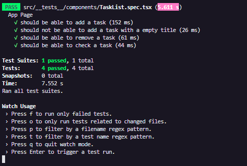
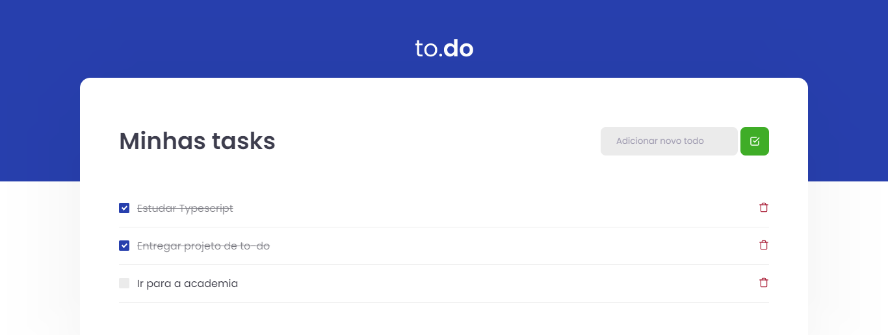

# 💻 Sobre o desafio

Esse projeto teve como principal objetivo criar uma pequena aplicação de atividades a se fazer (lista de to-do), para treinar um pouco mais sobre manipulação do estado no React. Os requisitos da aplicação eram: 

- Adicionar uma nova tarefa
- Remover uma tarefa
- Marcar e desmarcar uma tarefa como concluída

# Especificação dos testes

- **should be able to add a task**

Para que esse teste passe, você deve permitir que task seja criada e com isso, exibida em tela. As tasks criadas devem conter os atributos seguindo o padrão da interface, que é:

Task {
  id: number;
  title: string;
  isComplete: boolean;
}

- **should not be able to add a task with an empty title**

Para que esse teste passe, antes de criar uma nova task, você deve validar se algo foi digitado no input e não permitir a criação da task caso o valor seja vazio, caso o valor digitado seja vazio, você deve impedir a criação da task.

- **should be able to remove a task**

Para que esse teste passe, você deve permitir que ao clicar no botão com ícone de uma lixeira, a task relacionada a esse botão seja removida do estado da aplicação, consequentemente sendo removida da tela.

- **should be able to check a task**

Para que esse teste passe, você deve permitir que ao clicar no checkbox ao lado da task, ela seja marcada como concluída ou não concluída de acordo com seu estado atual, alterando seu valor de `isComplete` de `false` para `true` ou ao contrário, de `true` para `false`.

 

# Resultado final

## Testes:

## Website:

## [Video demostrativo](https://www.youtube.com/watch?v=0bSUBSnv2pA&ab_channel=EmanuelVieira)